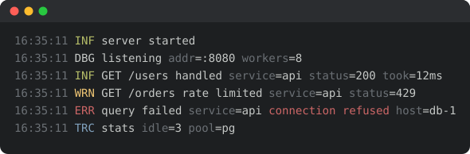

# Reggol

Reggol is a zero-allocation logger with a clear `Logger → Encoder → Writer` architecture and a
focus on fast, pretty console output.

Inspired by [zerolog](https://github.com/rs/zerolog), but smaller, with a different output format,
Blocks, and a first-class `log/slog` bridge.

[](https://raw.githack.com/wiki/efureev/reggol/coverage.html)
[](https://github.com/efureev/reggol/actions/workflows/test.yml)
[](https://goreportcard.com/report/github.com/efureev/reggol)

Languages: English | [Русский](./Readme.ru.md)

> **v1 is a clean break.** It shares no API with the 0.x line and there is no migration path:
> the core was rewritten to remove allocations, fix a data race in concurrent logging, and add
> child loggers, contexts and structured output. Pin `v0.4.1` if you need the old API.

## Installation

```bash
go get github.com/efureev/reggol
# or only the global facade
go get github.com/efureev/reggol/log
```

Supported Go versions: 1.25+.

## Features

- **Zero allocations** on every built-in path — message, typed fields, errors, blocks, colors,
  child loggers. Enforced in CI, not just measured.
- Three encoders: `ConsoleEncoder` (pretty, colored), `TextEncoder` (flat `key=value`),
  `JSONEncoder` (one object per line).
- Child loggers with bound fields: `logger.With().Str("service", "auth").Logger()`.
- `context.Context` support, including pluggable extractors for trace identifiers.
- `log/slog` bridge in `slogr/`, verified against the standard library's own conformance suite.
- Optional call sites (`WithCaller`), still allocation-free.
- 256-colour and 24-bit output, reduced automatically to what the terminal supports.
- **No dependencies at all** — not even indirect ones.
- Blocks — short tags in front of the message.
- Concurrency-safe by construction via `SyncWriter`.
- Typed, allocation-free formatting hooks.
- Automatic color detection, honoring `NO_COLOR` and `FORCE_COLOR`.

Deliberately smaller than zerolog: no sampling, no stack traces, no CBOR.

## Quick start

The global facade is ready to use: it writes pretty console output to stderr, synchronized.

```go
package main

import "github.com/efureev/reggol/log"

func main() {
    log.Info().Msg("hello world")
}
```

Build your own logger:

```go
package main

import (
    "os"

    "github.com/efureev/reggol"
)

func main() {
    logger := reggol.New(os.Stdout)
    logger.Info().Str("user", "bob").Msg("signed in")

    // Flat key=value text:
    text := reggol.New(os.Stdout, reggol.WithEncoder(reggol.NewTextEncoder()))
    text.Warn().Msg("disk almost full")
}
```

`New` returns a value and every method has a value receiver, so the inline form works too:

```go
reggol.New(os.Stdout, reggol.WithEncoder(reggol.NewTextEncoder())).Warn().Msg("disk almost full")
```

## Log levels

Levels: `Trace < Debug < Info < Warn < Error < Fatal < Panic`. Two thresholds apply, and an event
must clear both: the logger's own minimum and the global one. The global default is `Info`, which
is why `Debug` is invisible until you lower it.

```go
import (
    "flag"

    "github.com/efureev/reggol"
    "github.com/efureev/reggol/log"
)

func main() {
    debug := flag.Bool("debug", false, "enable debug")
    flag.Parse()

    if *debug {
        reggol.SetGlobalLevel(reggol.DebugLevel)
    }

    log.Debug().Msg("only in debug")
    log.Info().Msg("always visible (>= info)")
}
```

Per-logger minimum:

```go
logger := reggol.New(os.Stdout).Level(reggol.WarnLevel)
logger.Info().Msg("hidden")   // below warn
logger.Error().Msg("visible") // >= warn
```

## Fields, messages, errors

```go
log.Info().Str("user", "alice").Int("age", 30).Msg("profile updated")

// An error never displaces the message — both are rendered.
log.Error().Err(errors.New("db down")).Str("host", "db-1").Msg("query failed")
// ERR query failed db down host=db-1

// An explicit key is honored.
log.Error().AnErr("cause", err).Msg("failed")
```

Typed setters — `Str`, `Int`, `Int64`, `Uint64`, `Float64`, `Bool`, `Dur`, `Time`, `Bytes`,
`IPAddr`, `Any` — store their value without boxing, which is where the zero-allocation property
comes from. `Any` picks the most specific representation it can.

Fields are sorted by key for stable output; `WithoutSort()` keeps insertion order. Repeating a key
emits both entries rather than replacing the first, as `log/slog` does.

## Child loggers

Bind fields once and pay a memory copy per line instead of re-encoding them:

```go
requestLog := logger.With().
    Str("service", "auth").
    Int("shard", 7).
    Logger()

requestLog.Info().Str("user", "alice").Msg("token issued")
// INF token issued service=auth shard=7 user=alice
```

Bound fields precede event fields, and sorting applies within each group rather than across them —
a global sort would require decoding the bound prefix on every line.

Configure the encoder before creating child loggers: bound fields are rendered at
`Logger()` time, so later hook changes do not apply to them.

## Contexts

```go
ctx := logger.WithContext(context.Background())
if l, ok := reggol.FromContext(ctx); ok {
    l.Info().Msg("found in context")
}
```

Extractors pull values out of a context onto every event. With none installed the path is free:

```go
logger := reggol.New(os.Stdout,
    reggol.WithContextExtractor(func(ctx context.Context, e *reggol.Event) {
        if id, ok := ctx.Value(traceKey{}).(string); ok {
            e.Str("trace_id", id)
        }
    }),
)

logger.Ctx(ctx, reggol.InfoLevel).Msg("handled")
```

## Call sites

`WithCaller` records where each record was produced:

```go
logger := reggol.New(os.Stdout, reggol.WithCaller())
logger.Info().Str("user", "alice").Msg("signed in")
// 2:09PM INF api/handler.go:42 signed in user=alice
```

The path is shortened to its last two segments, which tells you the package
without leaking the build machine's directory layout. Text and JSON put it in a
`caller` field.

It is off by default because it is not free: capturing and resolving a program
counter costs roughly 2.5x the price of a record — about 78 ns to 200 ns on an
M5 Pro — though it still allocates nothing. Enable it per event instead with
`Event.Caller()` when only a few sites matter.

Code that wraps reggol behind its own helpers must account for the frames it
adds, or the reported position will be the wrapper:

```go
func (l MyLogger) Info(msg string) { l.inner.AddCallerSkip(1).Info().Msg(msg) }
```

`EventData.Caller` and `EventData.CallerFunction` expose the position and the
function name to formatting hooks.

## Blocks

Blocks are short markers before the message — a component name, a request tag:

```go
log.Info().Blocks("API", "GET /users").Msg("ok")

block := reggol.NewBlock("auth", func(s string) string { return "[" + s + "]" })
log.Info().Block(block).Msg("token verified")
```

## Encoders

| Encoder | Output |
|---|---|
| `NewConsoleEncoder` | `2:09PM INF hello int=123 string=four!` |
| `NewTextEncoder` | `ts=…, level=info, message=hello, int=123` |
| `NewJSONEncoder` | `{"ts":"…","level":"info","message":"hello","int":123}` |

Shared options: `WithTimeFormat`, `WithoutTimestamp`, `WithoutLevel`, `WithoutSort`,
`WithKeyNames`, plus the formatting hooks `WithLevelFormatter`, `WithTimeFormatter`,
`WithFieldFormatter`, `WithKeyFormatter`, `WithValueFormatter`, `WithMessageFormatter`,
`WithBlocksFormatter`, `WithBeforeEncode`, `WithAfterEncode`.

Hooks append into a caller-owned buffer rather than returning a string, so customizing output
costs nothing:

```go
enc := reggol.NewTextEncoder(
    reggol.WithLevelFormatter(func(dst []byte, l reggol.Level) []byte {
        return append(dst, strings.ToUpper(l.String())...)
    }),
)
```

Console-specific options go through `WithColorMode` and `WithConsoleOptions`:

```go
enc := reggol.NewConsoleEncoder(
    reggol.WithColorMode(reggol.ColorAuto, os.Stderr),
    reggol.WithConsoleOptions(reggol.WithTimeFormat(time.RFC3339)),
)
```

`ColorAuto` emits color only when the destination is a terminal, and respects `NO_COLOR`,
`FORCE_COLOR` and `TERM=dumb`. `ColorAlways` and `ColorNever` force the decision.

### Extended colors

Beyond the named set, a level can use the 256-colour palette or 24-bit colour:

```go
enc := reggol.NewConsoleEncoder(reggol.WithColorDepth(reggol.DepthAuto))
enc.SetLevelStyle(reggol.ErrorLevel, reggol.Style{
    Fg:    reggol.ColorRGB(0xff, 0x66, 0x00),
    Attrs: reggol.ColorBold,
})
```

`DepthAuto` reads `COLORTERM` and `TERM`, and anything the terminal cannot
express is reduced rather than printed as escape codes: a 24-bit colour becomes
the nearest palette entry on a 256-colour terminal and the nearest basic colour
on a 16-colour one. `Depth16`, `Depth256` and `DepthTrueColor` force the choice.

`SetLevelColor` still takes a `TextStyle` and remains the short way to use the
named colours.

## Writers and concurrency

A logger is exactly as concurrency-safe as the writer underneath it, and most writers — including
`bytes.Buffer` and anything wrapping one — are not safe at all. Wrap them:

```go
logger := reggol.New(reggol.SyncWriter(out))
```

The facade in `log/` already does this. `MultiWriter` fans one event out to several destinations.

Encoders terminate each record with exactly one `\n`; writers pass the bytes through untouched.

## log/slog

`slogr` makes reggol a backend for the standard library's structured logger. It passes
`testing/slogtest`, the conformance suite `log/slog` ships with.

```go
import (
    "log/slog"

    "github.com/efureev/reggol"
    "github.com/efureev/reggol/slogr"
)

logger := slogr.New(reggol.New(os.Stdout, reggol.WithEncoder(reggol.NewJSONEncoder())))
logger.Info("handled", slog.String("user", "alice"))
```

`slog.Handler` attributes bound with `WithAttrs` use the same pre-encoding as `With()`. Groups are
flattened into dotted keys, which keeps them meaningful in a `key=value` console line.

For slog-compatible key names:

```go
reggol.NewJSONEncoder(reggol.WithKeyNames(slog.TimeKey, slog.LevelKey, slog.MessageKey))
```

### Feeding an existing slog pipeline

`FromHandler` is the reverse direction: reggol's chained API in front of a handler the
application already owns.

```go
logger := slogr.FromHandler(existingHandler)
logger.Info().Str("user", "alice").Msg("handled")
```

Records are handed over structurally, and the caller's context reaches `Handle`, so
context-aware handlers keep working. Two level thresholds apply — reggol's process-wide
`GlobalLevel` first, the handler's second — and this path allocates, because `slog.Record`
copies attributes.

## Fatal and Panic

- `logger.Fatal().Msg(…)` closes the writer to flush, then calls `os.Exit(ExitCode())`, default 1.
  It exits **even when the level filters the event out**: suppressing a record is a logging
  decision, suppressing termination would let a raised log level silently change control flow.
- `logger.Panic().Msg(…)` writes, then panics with the message.

## Global settings

- `reggol.SetGlobalLevel(lvl)` / `reggol.GlobalLevel()` — the process-wide minimum.
- `reggol.SetExitCode(code)` / `reggol.ExitCode()` — the code used by `Fatal`.
- `reggol.SetErrorHandler(fn)` — called when writing an event fails; without one, failures are
  reported on stderr.

All of these are guarded by atomics and safe to change at runtime.

## Performance

Measured on go1.26, darwin/arm64, Apple M5 Pro, via `go test -bench=. -benchmem`:

| Benchmark | ns/op | allocs/op |
|---|---:|---:|
| `Disabled` | ~0.4 | **0** |
| `LogFields` (3 typed fields) | ~32–40 | **0** |
| `Info` (message only) | ~58–66 | **0** |
| `Child` (3 bound fields) | ~65 | **0** |
| `stdlib slog TextHandler` (same fields) | ~227 | 3 |

Wall-clock numbers move with machine load; the allocation counts do not, which is why CI gates on
allocations and treats timings as informational.

Tips:

- Reuse one logger per component instead of building one per line.
- Bind repeated fields with `With()` rather than repeating them at each call site.
- `WithoutSort()` if key order does not matter.
- Guard expensive `Msgf` arguments with `e.Enabled()`.

## Screenshot



The image is generated from the library itself — regenerate it with
`make screenshot` whenever the console format changes.

Release history: [CHANGELOG.md](./CHANGELOG.md).

## License

MIT. See LICENSE.
